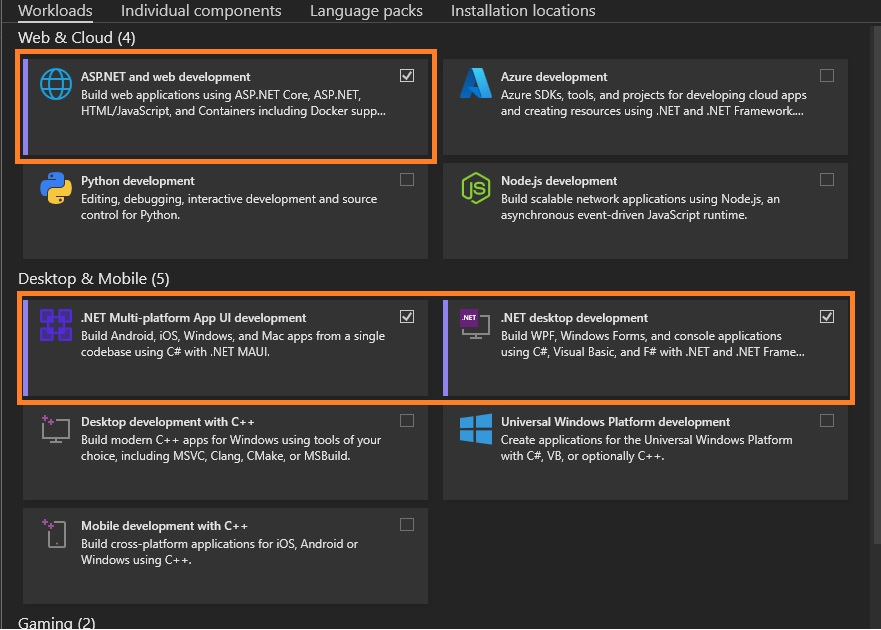

# V 35

## Måndag (Toads)

### 09:00-11:00 Intro

Kursstart och presentation av kursen.

1. Presentation av Niklas och upprop.
2. Installation av miljö och verktyg.
   - Ladda ner och installera [Visual Studio Community 2022](https://visualstudio.microsoft.com/thank-you-downloading-visual-studio/?sku=Community&channel=Release&version=VS2022&source=VSLandingPage&cid=2030&passive=false).
     - I installationen välj paketen enligt .
   - Ladda ner och installera [Git](https://git-scm.com/download/win).
   - Skapa ett konto på [GitHub](https://github.com/).

### 12:30-16:00 Övning (Deadline Onsdag 31/8)

För att säkerställa att samtliga har installerat allt ifrån förmiddagen så kommer ni också att få en övning där alla verktygen används. Det krävs inga kunskaper i programmering.

[Introduktionsövning](./IntroÖvning.md)

## Onsdag (Toads)

### 09:00-11:45 Lära känna varandra och C# Syntax

Lära känna varandra med lite lek. 
Genomgång av introduktionsövningen.
#### Material:
* [w3Schools - Syntax](https://www.w3schools.com/cs/cs_syntax.php)
* [w3Schools - Comments](https://www.w3schools.com/cs/cs_comments.php)
* [Slides](./Slides/Slides-V34.pdf)
### 13:15-16:00 Datatyper och Villkor.
Genomgång av **Datatyper** och **Variabler**.  
Genomgång av villkor.  
Intro till [Codingame](https://www.codingame.com). 
Presentation av **Labb 1**.

* [Power of Thor](https://www.codingame.com/training/easy/power-of-thor-episode-1)
#### Material:
* [w3Schools - Variables](https://www.w3schools.com/cs/cs_variables.php)
* [w3Schools - Data Types](https://www.w3schools.com/cs/cs_data_types.php)
* [w3Schools - If...Else](https://www.w3schools.com/cs/cs_conditions.php)
* [w3Schools - Switch](https://www.w3schools.com/cs/cs_switch.php)
* [Slides](./Slides/Slides-V34-2.pdf)

## Torsdag (Distans)
### 09:00-11:45 Loopar
Genomgång av Loopar
#### Material:
* [w3Schools - While](https://www.w3schools.com/cs/cs_while_loop.php)
* [w3Schools - For](https://www.w3schools.com/cs/cs_for_loop.php)
* [w3Schools - Break and Continue](https://www.w3schools.com/cs/cs_break.php)
* [Slides](./Slides/Slides-V34-3.pdf)
### 13:15-16:00 Övning Loopar och Villkor
Live demo av **Console**  
Niklas gör några övningsuppgifter live.
* [Övningsuppgifter](./%C3%B6vningar.md)
* [The Descent](https://www.codingame.com/training/easy/the-descent)

#### Material:
[w3Schools - User Input](https://www.w3schools.com/cs/cs_user_input.php)

